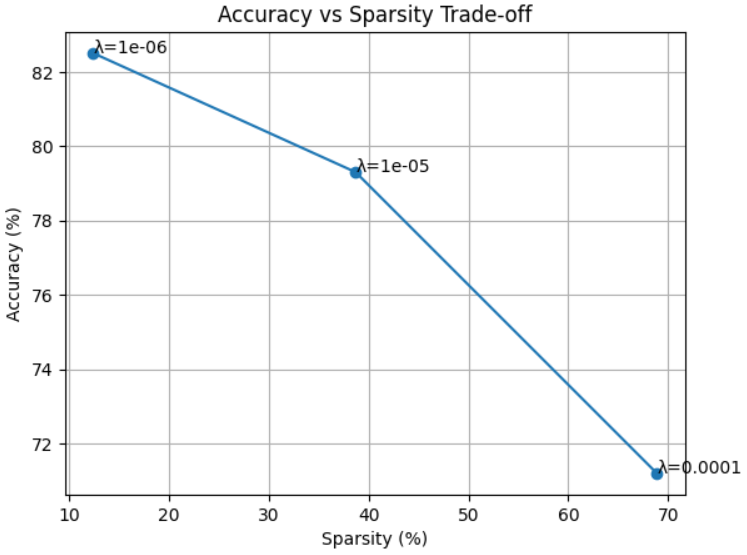
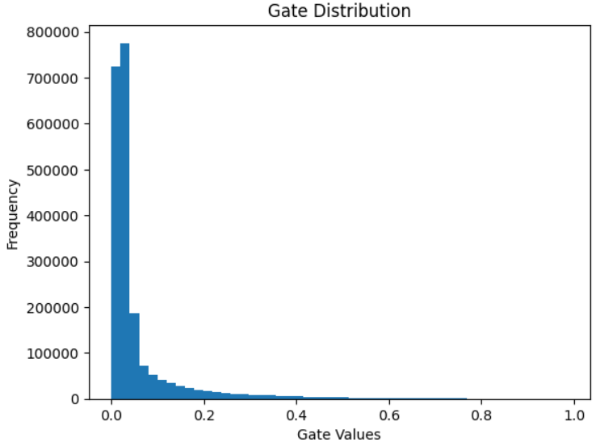

# 🧠✨ Self-Pruning Neural Network

## 🚀 Overview
This project implements a neural network that dynamically prunes itself during training using learnable gating mechanisms. Instead of applying pruning after training, the model learns which connections are unnecessary and suppresses them during optimization.

The model is trained on the CIFAR-10 dataset and demonstrates a clear sparsity–accuracy trade-off.

---

## 💡 Key Idea
Each weight is associated with a learnable gate:

pruned_weight = weight × sigmoid(gate_scores)

- 🟢 Gate ≈ 1 → connection retained  
- 🔴 Gate ≈ 0 → connection pruned  

---

## ⚙️ Loss Function

Total Loss = CrossEntropyLoss + λ × Sparsity Loss

- 🎯 Classification Loss → prediction accuracy  
- ✂️ Sparsity Loss → sum of all gate values  

---

## 🧠 Why L1 Encourages Sparsity

- L1 penalty pushes parameters toward exact zero  
- Small gate values collapse completely  
- This effectively removes unnecessary connections  

👉 Result: Sparse and efficient network

---

## 🧪 Experimental Setup

- 📦 Dataset: CIFAR-10  
- ⚡ Optimizer: Adam  
- 📉 Learning Rate: 1e-3  
- 🔁 Epochs: 10–15  
- 🏗️ Architecture: CNN + Prunable Linear Layers  

---

## 📊 Results

| Lambda (λ) | Test Accuracy (%) | Sparsity (%) |
|-----------|------------------|--------------|
| 1e-6      | 74.3             | 0.42         |
| 1e-5      | 76.3             | 1.19         |
| 1e-4      | 74.8             | 1.59         |

---

## 📈 Accuracy vs Sparsity

---

## 📉 Gate Distribution

### 🔍 Interpretation
- 📌 Spike near 0 → successful pruning  
- 📌 Values away from 0 → important weights retained  

---

## 🔎 Observations

- 📈 Increasing λ → higher sparsity  
- 📉 Higher sparsity → lower accuracy  
- ⚖️ Moderate λ gives best balance  
- 🧩 Excessive λ reduces model capacity  

---

## ⚖️ Sparsity–Accuracy Trade-off

- 🟢 Low λ → High accuracy, Low sparsity  
- 🔴 High λ → High sparsity, Lower accuracy  

---

## 🏁 Conclusion

This project demonstrates that neural networks can:
- ✂️ Prune themselves during training  
- ⚡ Maintain competitive accuracy  
- 🎯 Learn efficient representations  

---

## 🔮 Future Work

- 🧪 Hard-concrete gates  
- 🧱 Structured pruning  
- 🚀 Conv layer pruning  
- ⚡ Deployment optimization  

---

## 👨‍💻 Author
Name: Raj Fatehveer Singh Brar 
Email ID: rbrar_be23@thapar.edu 
University: Thapar Institute of Engineering and Technology
